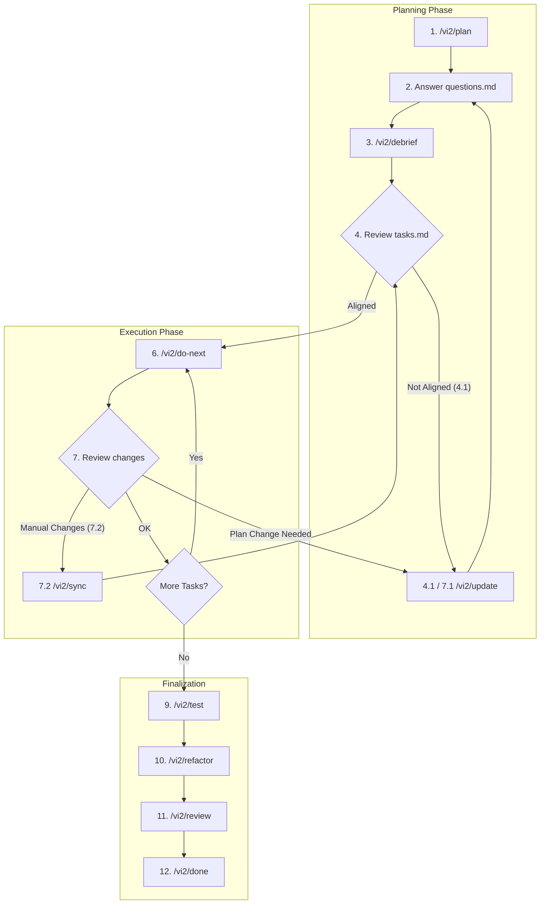

# vi2 — Vibe Coding V2

A prompt framework for [Cursor AI](https://cursor.com/) that replaces ad-hoc prompting with a structured, repeatable workflow for building software with LLMs.

## The Problem

Working with AI coding assistants often feels chaotic. You spend more time wrestling with prompts than thinking about your product. Specifically:

- **Prompt engineering overhead.** You end up crafting elaborate prompts instead of focusing on requirements and architecture. The LLM should be asking *you* the right questions, not the other way around.
- **Silent decisions and shallow questions.** Cursor can ask clarifying questions during planning, but in practice the AI often makes implementation choices silently — picking a library, choosing an architectural pattern, or deciding on an API shape without surfacing the alternatives. When it does ask, the questions tend to be brief, without enough detail about each option to make an informed decision. You only discover the AI chose wrong after the code is written.
- **Limited control over the execution plan.** Cursor has [Plan Mode](https://cursor.com/blog/plan-mode) that can research your codebase, ask clarifying questions, and produce a Markdown plan. But in practice, that plan lives inside a single chat session. When you discover problems mid-execution — the "rocks under the water" that only become visible after several tasks are done — you need a reliable way to pause, reshape the plan, and continue. vi2 serializes the plan into a persistent file (`tasks.md`) that you can review, edit manually, or adjust through dedicated commands like `/vi2/update` at any point.
- **No stable-state guarantee between steps.** Complex features span many files. When a task is only partially done, the project may not build or tests may fail until the AI finishes "the next step." If something goes wrong in the middle, you're left with a broken codebase and no clean rollback point.
- **LLM amnesia.** Long conversations lose context. The AI forgets a decision it made 20 messages ago. External documentation you pasted earlier vanishes from its working memory. You repeat yourself constantly.
- **Session lock-in.** Everything lives in a single chat thread. If the conversation gets too long, or Cursor crashes, or you want a fresh Agent — you have to re-explain the entire project state from scratch.

## How vi2 Solves It

vi2 is a set of 12 Cursor commands (slash commands) that enforce a disciplined development workflow. The core idea is simple: **externalize the AI's plan and context into files that both you and the AI can read, review, and edit.**

When you run `/vi2/plan`, the framework creates a temporary `.vi2/` directory in your project with three artifacts:

| Artifact         | Purpose                                                                                                                                           |
|:-----------------|:--------------------------------------------------------------------------------------------------------------------------------------------------|
| `tasks.md`       | A deterministic execution checklist. No vague "investigate" steps — every task is concrete and actionable.                                        |
| `llm_context.md` | A knowledge snapshot. All external docs, API specs, code analysis, and technical decisions are cached here so the AI never "forgets".             |
| `questions.md`   | A structured dialogue. When the AI encounters ambiguity, it doesn't guess — it lists options, gives recommendations, and waits for your decision. |

These files are your contract with the AI. They survive across sessions, so you can close Cursor, open a new Agent, and pick up exactly where you left off.

### Design Principles

**You review the plan before any code is written.** The `/vi2/plan` command performs all research upfront — reading docs, analyzing your codebase, caching knowledge — and then produces a plan for your approval. No code changes until you say go.

**Every task leaves the project in a working state.** This is the framework's most critical rule. After any task completes, the code must build and tests must pass. No more "I'll fix the imports in the next step."

**Every decision point becomes a question.** The AI is pushed to proactively surface choices instead of making them silently. See [The Question Loop](#the-question-loop) below.

**Context lives in files, not in chat history.** `llm_context.md` holds everything the AI needs to know. This means you can start a fresh Agent session, and the AI can reload full context from disk. No more re-explaining.

**Your code is the single source of truth.** If you make manual changes, `/vi2/sync` updates the plan to match your code — not the other way around. The framework adapts to you.

### The Question Loop

Cursor can ask clarifying questions during planning. vi2 takes this further by making the question flow a core part of the workflow — not an occasional prompt, but a structured subflow that runs through `questions.md` and `/vi2/debrief`.

The framework pushes the AI to behave differently in three ways:

1. **Proactive question raising.** Any time the AI sees multiple valid approaches — a library choice, an architectural pattern, an API design — it must raise a question instead of picking silently. In most cases you'll agree with the AI's choice, but the goal is to make every decision visible so you can approve or redirect before code is written.

2. **Detailed options with context.** Each question lists concrete options (Option A, Option B, ...) with enough technical detail to make a decision without leaving the file. Instead of "Should we use approach X or Y?", the AI explains what each approach means for the codebase, what trade-offs it carries, and what it implies for future tasks. This saves you from having to read code or documentation just to understand what the AI is proposing.

3. **A recommended path.** Every question includes the AI's recommendation — the option it would have picked if it weren't asking. This dramatically speeds up the decision process: for most questions, you simply confirm the recommendation. When you disagree, you already have the full context to choose differently.

This subflow minimizes hallucinations and misunderstandings. Instead of the AI silently committing to an approach and building on top of a wrong assumption for several tasks, every ambiguity is surfaced early and resolved explicitly. Your answers are translated into technical decisions stored in `llm_context.md`, so they persist across sessions and are never forgotten.

## Installation

**Prerequisites:** [Cursor AI](https://cursor.com/) editor.

**Marketplace (recommended):**
```
/add-plugin vi2
```

**Manual — Global** — enables vi2 for all your Cursor projects:
```bash
cp -r commands ~/.cursor/commands/vi2
```

**Manual — Project-specific** — copy the `commands` directory into your project's `.cursor/commands/vi2` folder.

The `.vi2/` working directory is already included in `.gitignore` by default in this repo. If you're adding vi2 to an existing project, add `.vi2/` to your `.gitignore`.

## Commands

### Planning

| Command        | What it does                                                                                                                                                                           |
|:---------------|:---------------------------------------------------------------------------------------------------------------------------------------------------------------------------------------|
| `/vi2/plan`    | Analyzes your requirements, investigates all referenced URLs and code, and generates the three artifacts in `.vi2/`. All research happens here — no "investigation" tasks are created. |
| `/vi2/debrief` | Reads your answers from `questions.md`, translates them into technical decisions in `llm_context.md`, updates the task list accordingly, and removes resolved questions.               |
| `/vi2/update`  | Integrates new or changed requirements into the existing plan. Performs gap analysis, adds/modifies/removes pending tasks, and preserves all completed work history.                   |

### Execution

| Command         | What it does                                                                                                                                                          |
|:----------------|:----------------------------------------------------------------------------------------------------------------------------------------------------------------------|
| `/vi2/do-next`  | Picks the next incomplete task, loads relevant context, implements it, verifies the build and tests pass, and marks it done. Reports build/test status on completion. |
| `/vi2/sync`     | After you make manual code changes, this command reconciles the artifacts with reality. Your code is treated as the single source of truth.                           |
| `/vi2/rollback` | Reverts code and artifacts to a previous stable state. Can target a specific task ID or just undo the last completed task.                                            |

### Quality

| Command         | What it does                                                                                                                                          |
|:----------------|:------------------------------------------------------------------------------------------------------------------------------------------------------|
| `/vi2/test`     | Runs the test suite, identifies coverage gaps, writes missing tests, and updates artifacts with findings.                                             |
| `/vi2/review`   | Performs a structured code review covering functionality, security, performance, and maintainability. Classifies issues by severity.                  |
| `/vi2/refactor` | Identifies and executes refactoring opportunities. Handles planned refactoring tasks, mid-execution refactoring, and newly discovered technical debt. |

### Monitoring & Finalization

| Command         | What it does                                                                                                                                            |
|:----------------|:--------------------------------------------------------------------------------------------------------------------------------------------------------|
| `/vi2/status`   | Generates a progress report: completion percentage, next actions, blockers, open questions, and risk areas.                                             |
| `/vi2/validate` | Checks artifact integrity — format, dependencies, cross-references, and consistency between all three files.                                            |
| `/vi2/done`     | Verifies all tasks are complete, generates a final report with recommended git commit message and PR description, then cleans up the `.vi2/` directory. |

## Workflow

### Step 1: Plan

```
/vi2/plan @requirements.md
```

Or describe your requirements directly in the chat. The AI will research everything, cache the knowledge, produce a task list, and (almost always) generate questions for you.

### Step 2: Answer Questions

Open `.vi2/questions.md`. Each question has options and a recommendation. Fill in your answers next to the `**Answer**:` placeholders.

```
/vi2/debrief
```

The AI processes your answers, updates the plan, and may ask follow-up questions. Repeat until `questions.md` is empty.

### Step 3: Review the Plan

Open `.vi2/tasks.md` and make sure the plan matches your vision. If something is off:

```
/vi2/update <your clarifications or new requirements>
```

This may generate new questions — cycle back to Step 2 if needed.

### Step 4: Execute

```
/vi2/do-next
```

The AI implements one task, verifies the build and tests, and reports the result. Review the changes. Repeat until all tasks are done.

If you need to adjust the plan mid-execution, use `/vi2/update`. If you made manual code changes, use `/vi2/sync`. If something went wrong, use `/vi2/rollback`.

### Step 5: Finalize

```
/vi2/test
/vi2/refactor
/vi2/review
/vi2/done
```

The test/refactor/review cycle ensures quality. `/vi2/done` generates a completion report with a recommended commit message and PR description, then removes the `.vi2/` directory.

### Workflow Diagram



## Tips

- **Start fresh sessions freely.** The whole point of the artifacts is that they survive across sessions. Feel free to open a new Agent whenever a conversation gets long. The AI will reload context from `.vi2/`.
- **Use `/vi2/status` to orient yourself.** After resuming work or switching context, run status to see where things stand.
- **Provide requirements as files.** `/vi2/plan @requirements.md` works better than pasting long requirements into chat. The AI gets the full content and can reference it precisely.
- **Don't skip the question loop.** The planning phase (plan → debrief → review → repeat) is where you shape the outcome. Rushing to `/vi2/do-next` without reviewing the plan leads to rework.
- **Manual changes are fine.** The framework doesn't lock you out of your own code. Make changes whenever you want, then run `/vi2/sync` to bring the artifacts up to date.
- **Use `/vi2/validate` when things feel off.** If the AI seems confused or tasks don't make sense, validate the artifacts to check for inconsistencies.

## Author

[Andrii Paslavskyi](https://github.com/paslavsky)

## License

Distributed under the [MIT License](LICENSE).
