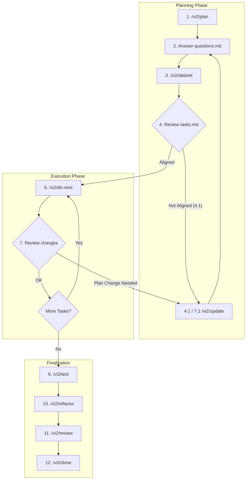

# vi2 - Vibe Coding V2

Structured commands for Cursor AI to manage complex development tasks using the **Vibe Coding V2** framework.

### Summary
The **vi2** framework (Vibe Coding V2) manages LLM-driven development through a temporary `./.vi2/` directory. It maintains a knowledge snapshot (`llm_context.md`), an execution checklist (`tasks.md`), and a question log (`questions.md`). This ensures consistency and code stability across multiple AI interactions.

### Key Features
- **Structured Workflow:** Replaces chaotic AI interactions with a predictable, step-by-step process.
- **Stable State Management:** Each task is designed to leave the codebase in a buildable and testable state.
- **Context Caching:** Stores technical decisions and external documentation in `llm_context.md` to prevent "LLM amnesia".
- **Interactive Feedback:** Uses `questions.md` and `/vi2/debrief` for a clear dialogue between you and the AI.

### Prerequisites
- [Cursor AI](https://cursor.com/) editor.

### Installation
1. **Project-specific:** Simply copy the `.cursor/commands/vi2` directory into your project's `.cursor/commands/` folder.
2. **Global (recommended):** Copy the `.cursor/commands/vi2` directory to `${user.home}/.cursor/commands/vi2`. This enables the **vi2** workflow for all your Cursor projects.

### Command List

| Command         | Purpose     | When to Use                                                 |
|:----------------|:------------|:------------------------------------------------------------|
| `/vi2/plan`     | **Setup**   | Analyze requirements and generate the initial plan.         |
| `/vi2/do-next`  | **Execute** | Implement the next available task from the checklist.       |
| `/vi2/status`   | **Monitor** | Check project progress and identify blockers.               |
| `/vi2/test`     | **Verify**  | Run tests and analyze code coverage.                        |
| `/vi2/review`   | **Audit**   | Review recently implemented code for quality and bugs.      |
| `/vi2/refactor` | **Clean**   | Systematically improve code and reduce technical debt.      |
| `/vi2/update`   | **Adjust**  | Integrate new requirements into the existing plan.          |
| `/vi2/rollback` | **Revert**  | Restore the codebase to a previous stable state.            |
| `/vi2/debrief`  | **Process** | Update the plan based on answers to previous questions.     |
| `/vi2/validate` | **Check**   | Verify the integrity of internal framework files.           |
| `/vi2/done`     | **Finish**  | Generate a final report and remove the `./.vi2/` directory. |

### Workflow Diagram

### Sample of Usage

1.  `/vi2/plan @<some_file_with_requirements.md>` (preferred approach) or `/vi2/plan <describe your requirements>`
2.  Edit `/.vi2/questions.md`, provide your answers
3.  `/vi2/debrief`
4.  Review `/.vi2/tasks.md` and make sure that everything is aligned with your vision
    *   4.1. If not - use `/vi2/update <your clarifications>` (new questions could appear)
5.  Repeat steps 2-4
6.  `/vi2/do-next`
7.  Review changes
    *   7.1. **Mid-process adjustment:** Use `/vi2/update <clarifications>` if you need to change the plan or add requirements at any point.
8.  Repeat steps 6-7 until the end of the plan
9.  `/vi2/test`
10. `/vi2/refactor`
11. `/vi2/review`
12. `/vi2/done`

### Author
[Andrii Paslavskyi](https://github.com/paslavsky)

### License
Distributed under the [MIT License](LICENSE).
